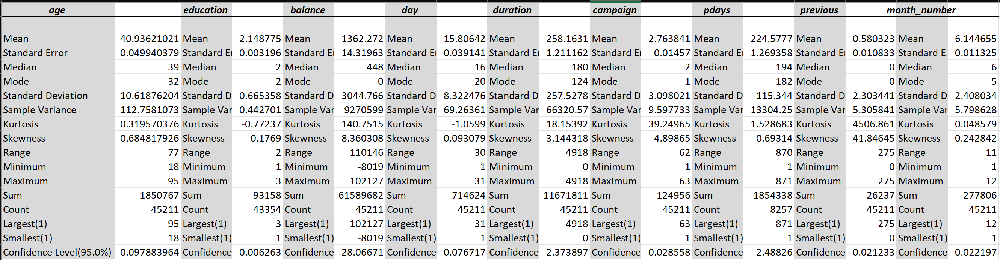
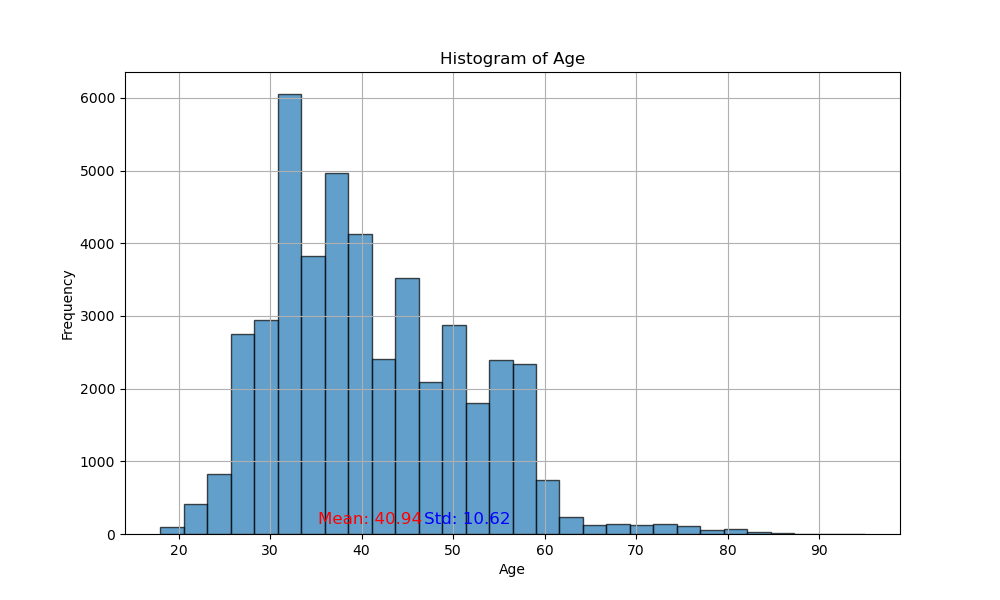
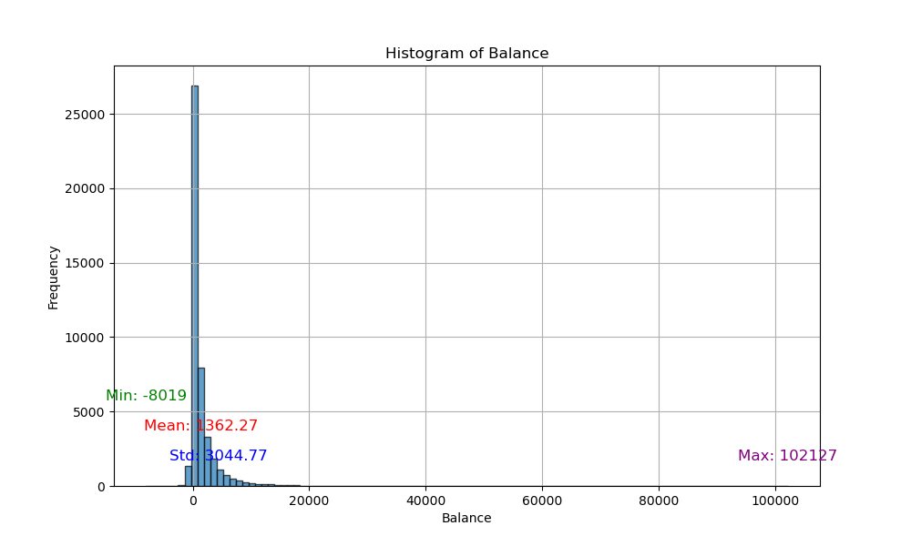
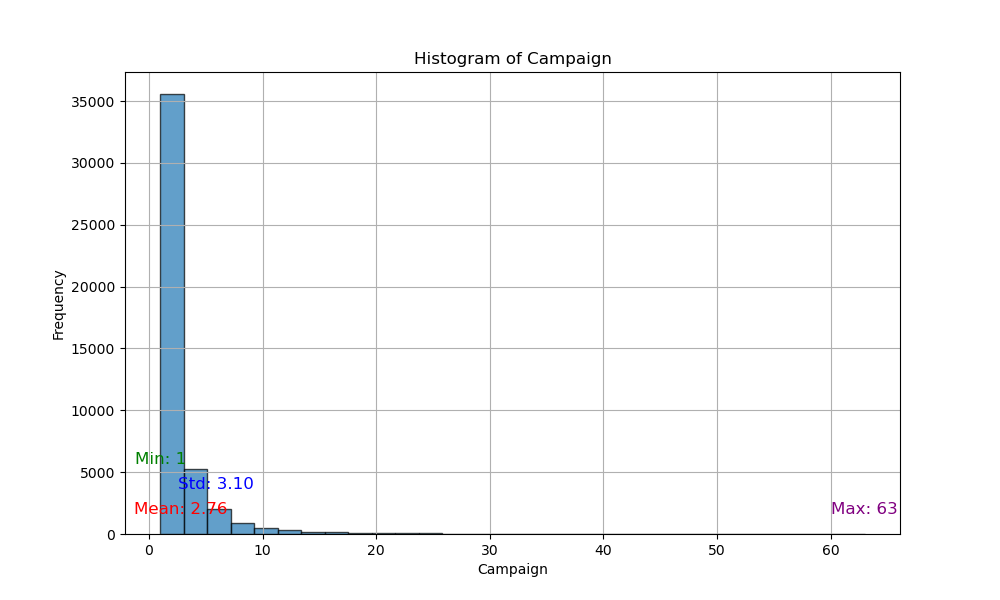
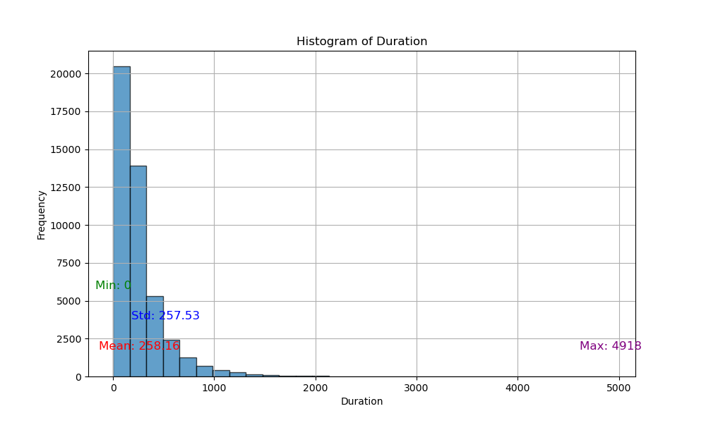
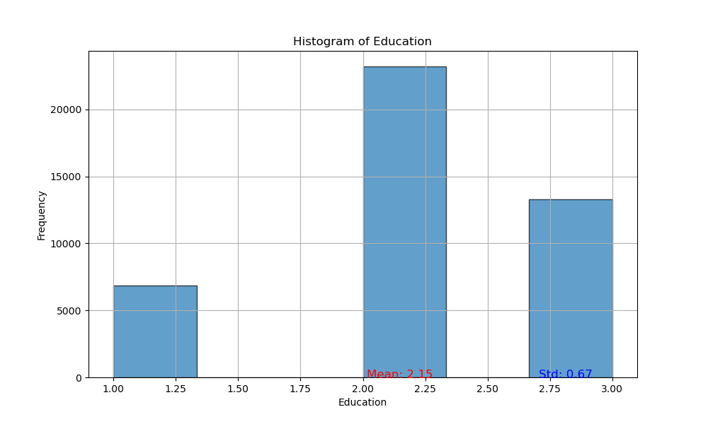
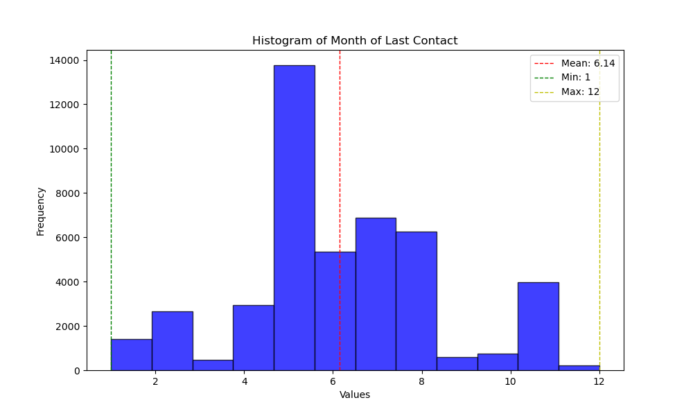
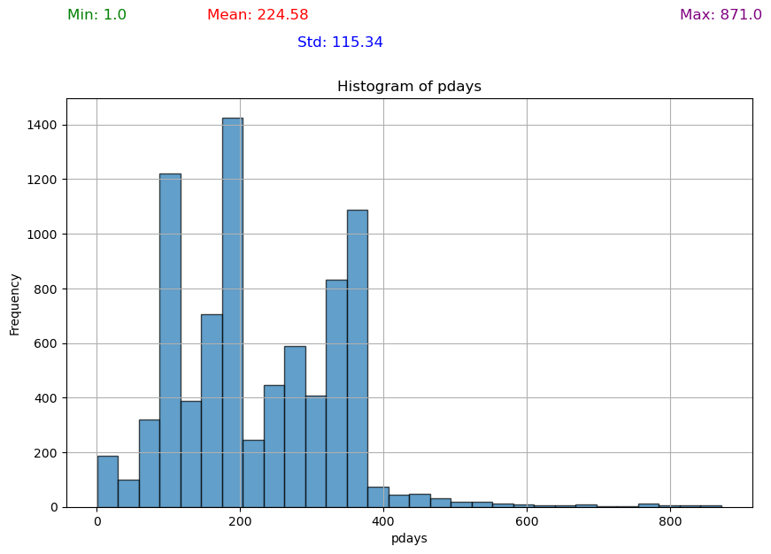
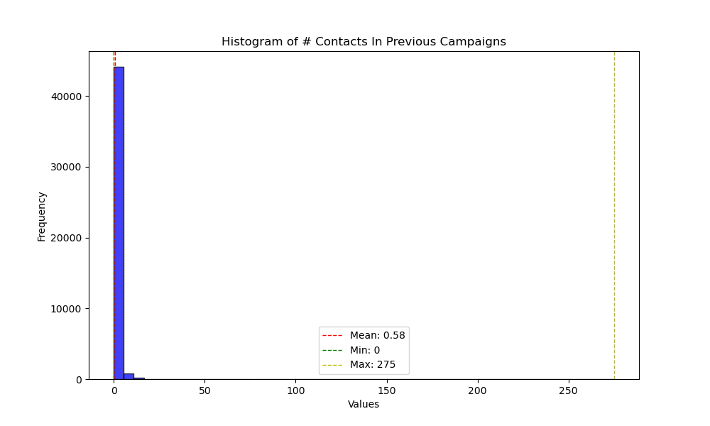

# Bank Marketing Campaign Analysis & Dashboard 
#### By Brigitte Yan, June 2024
-------------------------------
### Abstract

- blah 


-------------------------------
### Introduction
The purpose of this project is to uncover insights from a dataset on term deposit marketing campaigns conducted by a bank in Portugal. Term deposits enhance banks' lending capabilities by locking in customer funds for a fixed period in exchange for higher interest rates. Analyzing factors influencing term deposit enrollments helps banks design effective marketing strategies, ultimately boosting enrollment and increasing their lending pool and revenues from interest payments from borrowers. 

To begin, I formulated several hypotheses based on domain knowledge for validation during analysis. I then formatted the data by creating dummy variables for categorical data and enumerating ordinal data. Next, I conducted a correlation analysis, bootstrapped with replacement to find confidence intervals, and performed hypothesis testing. Finally, I carried out PCA and k-means clustering. The results of my analysis informed the graphs included in my Excel dashboard, which succinctly captured the data patterns. This analysis can help small banks optimize their marketing strategies for term loans, ultimately increasing their lending pool and interest revenues and driving faster growth of the bank as a whole. 

-----------------------------
### Table Of Contents

1. [Repository Structure](#repository)
4. [Software Requirements & Packages](#installation)
2. [Dataset](#dataset)
4. [Hypothesis](#hypothesis)
4. [Data Wrangling](#wrangling)
6. [Analysis](#analysis)
6. [Results](#results)
6. [Discussion](#discussion)
3. [Dashboard](#dashboard)
7. [Conclusion](#conclusion)
8. [Contact](#contact)
9. [Sources Cited](#acknowledgements)
10. [License](#license)


----------------------------------
### Repository Structure<a name="repository"></a> 

<details>
  <summary>Click to see the repository skeleton.</summary>

  ``` plaintext
\
│   .gitattributes
│   .gitignore
│   README.md
│   repo_structure.txt
│
├── data\
│   ├── bank_combined.xlsx
│   ├── bank_dashboard.xlsx
│   ├── bank_dummiesonly.xlsx
│   ├── bank_nodummies.xlsx
│   ├── bank_original.xlsx
│   ├── bootstrap_means_balance_df.pkl
│   ├── bootstrap_means_duration_df.pkl
│   ├── bootstrap_means_n1000.pkl
│   ├── bootstrap_samples_n1000.pkl
│   ├── bootstrap_samples_n1000.zip
│   ├── bootstrap_samples_yes_df.pkl
│   └── df_scaled.pkl
│
├── images\
│   ├── bootstrap_means_age.png
│   ├── bootstrap_means_balance.png
│   ├── bootstrap_means_duration.png
│   ├── dashboard_sketchpng.png
│   ├── eigenvectors_PC1to3.png
│   ├── elbow_plot.png
│   ├── histogram_age.png
│   ├── histogram_balance_with_stats.png
│   ├── histogram_campaign_with_stats.png
│   ├── histogram_duration_with_stats.png
│   ├── histogram_education.png
│   ├── histogram_monthnum_with_stats.png
│   ├── histogram_pdays_with_stats.png
│   ├── histogram_previous_with_stats.png
│   ├── kmeans_clustering.png
│   ├── PCA.png
│   ├── QQ_plot_age.png
│   ├── QQ_plot_balance.png
│   ├── sample_means_age_95confidence.png
│   ├── sample_means_balance_95confidence.png
│   ├── sample_means_duration_95confidence.png
│   └── scree_plot.png
│
└── src\
    ├── data_prep.ipynb
    ├── histograms_bootstrap_confidence_intervals.ipynb
    ├── hypothesis_tests.ipynb
    └── PCA_kmeans_clustering.ipynb
```
</details>

-------------------------------
### Software Requirements & Packages<a name="installation"></a>
- [Microsoft Excel 2021](https://learn.microsoft.com/en-us/deployoffice/ltsc2021/overview)
- Windows 10/11
- Python 3.10
- Pandas, Numpy, Scipy, Matplotlib, Seaborn, Sklearn, mpl_toolkits, Pickle 

----------------------------------
### Dataset<a name="dataset"></a>
 [UC Irvine ML Library-- Bank Marketing]('https://archive.ics.uci.edu/dataset/222/bank+marketing')

The dataset comprises 45,211 records across 17 columns. Each row represents a customer contact event in a marketing campaign, with potential for multiple rows per customer, though customer IDs are not provided. Of the columns, 10 are categorical (including nominal, ordinal, and binary types), while 7 are numeric.

<details>
  <summary>Click to see the column headers.</summary>
  
  ```plaintext
  | Column No. | Attribute | Description |
  |------------|-----------|-------------|
  | 1          | age       | Numeric: the age of the client. |
  | 2          | job       | Categorical: the type of job ("admin.", "unknown", "unemployed", "management", "housemaid", "entrepreneur", "student", "blue-collar", "self-employed", "retired", "technician", "services"). |
  | 3          | marital   | Categorical: marital status ("married", "divorced", "single"; note: "divorced" includes widowed). |
  | 4          | education | Categorical (Ordinal): level of education ("unknown", "secondary", "primary", "tertiary"). |
  | 5          | default   | Binary: has credit in default? ("yes", "no"). |
  | 6          | balance   | Numeric: average yearly balance in euros. |
  | 7          | housing   | Binary: has housing loan? ("yes", "no"). |
  | 8          | loan      | Binary: has personal loan? ("yes", "no"). |
  | 9          | contact   | Categorical: contact communication type ("unknown", "telephone", "cellular"). |
  | 10         | day       | Numeric: last contact day of the month. |
  | 11         | month     | Categorical: last contact month of the year ("jan", "feb", "mar", ..., "nov", "dec"). |
  | 12         | duration  | Numeric: last contact duration in seconds |
  | 13         | campaign  | Numeric: number of contacts performed during this campaign and for this client (includes last contact) |
  | 14         | pdays     | Numeric: number of days that passed by after the client was last contacted from a previous campaign (-1 means the client was not previously contacted). |
  | 15         | previous  | Numeric: number of contacts performed before this campaign and for this client. |
  | 16         | poutcome  | Categorical: outcome of the previous marketing campaign ("unknown", "other", "failure", "success"). |
  | 17         | y         | Whether the client will subscribe to a term deposit ("yes", "no"). |
  ```
</details>


----------------------------------
### Hypothesis<a name="hypothesis"></a> 

Based on my understanding of term deposits and human behavior, these initial assumptions about the features will guide my analysis. They can be validated or refuted based on the results of the analysis:

- Positive correlations expected with: age, job, marital status, education level, balance, and term deposit success. his assumption stems from the idea that individuals who have higher levels of education, employment and marriage are in a better position to subscribe to term loans. 
- Negative correlations anticipated with: housing loan status, personal loan status, default status, and term deposit success. This assumption stems from the idea that individuals with more loans may have less disposable income to commit to term deposits.


----------------------------------
### Data Wrangling<a name="wrangling"></a> 

- Generated dummy variables for categorical attributes: job, education, default, housing, loan, contact, poutcome, y, and marital.
- Created a new column, month_number, to represent months with enumerated names.
- Converted 'education' from string to integer to treat it as an ordinal variable, replacing 'unknown' with NaN.
- Consolidated all original and new columns into a unified dataframe, saving it as an Excel file named bank_combined.xlsx.
- Replaced -1 values in pdays with NaN.


----------------------------------
### Analysis<a name="analysis"></a>

First, I did a correlation analysis in Excel to find patterns to explore further through hypothesis testing:
<details>
  <summary>Click to expand.</summary>

  
</details>
<br>
The Excel Analysis Toolpak's descriptive statistics module efficiently computes metrics like mean, standard error (SE), and variance for numeric variables. However, these calculations are based on the data distribution itself rather than on the distribution of sample means. Consequently, metrics such as mean, SE, and skewness may appear larger when the data distributions deviate from normality. This issue is particularly significant for calculating the confidence interval.

<details>
  <summary>Click to expand.</summary>
  

</details>
<br>
I've verified this observation by plotting the histograms of several numeric variables, which depict distributions that indeed deviate from normality.
<details>
  <summary>Click to expand.</summary>

<div style="display: flex; justify-content: center;">
  <div style="margin: 10px;">
    
  </div>
  <div style="margin: 10px;">
    
  </div>
</div>

<div style="display: flex; justify-content: center;">
  <div style="margin: 10px;">
    
  </div>
  <div style="margin: 10px;">
    
  </div>
</div>

<div style="display: flex; justify-content: center;">
  <div style="margin: 10px;">
    
  </div>
  <div style="margin: 10px;">
    
  </div>
</div>

<div style="display: flex; justify-content: center;">
  <div style="margin: 10px;">
    
  </div>
  <div style="margin: 10px;">
    
  </div>
</div>

</details>
<br>


Since normality is preferred for confidence level calculations and assumed for statistical tests like the t-test, I generated additional samples using bootstrapping with replacement. As predicted by the central limit theorem, the resulting sample means distributions approximates normality better than the original distributions.

<details>
  <summary>Click to expand.</summary>
<div style="display: flex; justify-content: center;">
  <div style="margin: 10px;">
    
  </div>
  <div style="margin: 10px;">
    
  </div>
</div>

<div style="display: flex; justify-content: center;">
  <div style="margin: 10px;">
    
  </div>
</details>
<br>

Each bootstrap sample replicates the size of the original dataset to ensure representativeness. I conducted **1000 iterations (n)** for my bootstrap with replacement.

Based on patterns found in the correlations heatmap, I conducted the following hypothesis tests using bootstrapped samples (n = 1000):

  - **two-sample t-tests (alpha= 0.05):** 
    - Current campaign success (yes/no) vs. average annual balance ($)

  - **chi-square test(alpha= 0.05):**
    - House loan (yes/no) vs. current campaign success (yes/no)
    - Previous campaign's outcome (y/n/unknown/other) vs. current campaign success (yes/no)
    - Contact method vs. current campaign success (yes/no)
    - Contact method vs. previous campaign's outcome (y/n/unknown/other)

  - **one-way ANOVA (alpha= 0.05):**
    - Previous campaign's outcome (y/n/unknown/other) vs. balance

Lastly, I conducted a PCA analysis and k-means clustering, using a Scree Plot and Elbow Plot to find the optimal number of principal components and clusters. 


--------------------
### Results<a name="results"></a>
The positive correlations between balance and current campaign success, no housing loan and current campaign success, current campaign failure and yes housing loan support my earlier hypothesis.

**Notable positive correlations:**
- poutcome_unknown & balance 0.233804984
- y_yes & balance 0.106048857
- y_yes  & housing_no 0.139172702
- y_no & housing_yes 0.139172702
- y_no & contact_unknown 0.150934971
- poutcome_unknown & contact_unknown 0.291657431
- poutcome_success & y_yes 0.306788211

**Notable negative correlations:**
- poutcome_failure & balance -0.174939044
- poutcome_other & balance -0.102639208
- y_yes & balance 0.106048857
- y_no & balance -0.106048857
- y_no & housing_no -0.139172702
- y_yes & housing_yes -0.139172702
- poutcome_unknown & contact_cellular -0.264425506
- y_no & contact_cellular -0.135872936
- y_yes & contact_unknown -0.150934971


**Results of the Hypothesis tests:**
- **two-sample t-tests (alpha= 0.05):** 
  - Current campaign success (yes/no) vs. average annual balance ($)
    - P-value: 0.0
    - Reject the null hypothesis: There is a significant difference between the means.

- **chi-square test(alpha= 0.05):**
  - House loan (yes/no) vs. current campaign success (yes/no)
    - p-value: 2.918797605076633e-192
    - Reject the null hypothesis: There is a significant association between housing and current campaign success.
  - Previous campaign's outcome (y/n/unknown/other) vs. current campaign success (yes/no)
    - p-value: 0.0
    - Reject the null hypothesis: There is a significant association between the results of the last campaign and that of the current.
  - Contact method vs. current campaign success (yes/no)
    - p-value: 3.994899557849592e-230
    - Reject the null hypothesis: There is a significant association between the contact method and subscription to a term deposit.
  - Contact method vs. previous campaign's outcome (y/n/unknown/other)
    - p-value: 0.0
    - Reject the null hypothesis: There is a significant association between the contact method and the previous campaign's outcome.

- **one-way ANOVA (alpha= 0.05):**
  - Previous campaign's outcome (y/n/unknown/other) vs. balance
    - P-value: 0.0
    - Reject the null hypothesis: There is a significant difference between the groups.


**PCA**
- One column of each dummy variable was ommitted to eliminate multicollinearity, and in addition, all values were scaled to their z-scores. 
- Looking at the scree plot, it appears that PC1, PC2 and PC3 account for most of the variation in the data.


**K-Means Clustering**
- The elbow plot didn't show a clear bend so I decided to create three clusters (k = 3).

 


--------------------

### Discussion<a name="discussion"></a>
- blahblah

----------------------------------


### Dashboard<a name="dashboard"></a>

- the slicers are the categorical variables e.g. job, marital, education, etc...
- the KPIs are mostly the numeric values 
- the graphs show relationships that were found to be significant from hypothesis tests 
- graph of month and day of last contact 


-------------------------
### Conclusion<a name="conclusion"></a>

- being able to predict whether a client will subscribe to a term plan in the next contact during the campaign can help small banks optimize their resources to strategically decide when to contact, who to contact
- more term deposits means a larger pool of money the bank can loan out to generate revenues from interest, which means growth for the bank 
- the info in the given dataframe is pretty general and could be found with a simple credit check and client profile view; even though it would be beneficial to have more detailed info, this dataset strikes a decent balance between easy to acquire and detailed-enough 


possible interaction factors:
- education & marital
- education & job
- balance & housing
- balance & loan 
- age & job 


possible confounding factors:
- holidays, weekends 
- income of spouse, number of children
- location 
- other debts
- primary language 
- gender/sex


Questions:
- Holidays in Spain that might affect the final decision
- what types of loans are these "personal loans"?
- what are the values of personal and housing loans?
- incomes?
- number of loans in total?
- duration, interest rate, amount of the term deposit account being marketed 


-----------------------
### Contact<a name="contact"></a>
Feel free to email me for suggestions or feedback. 

<a href="mailto:brigitte.xyan@gmail.com">
  
</a>


--------------------------
### Sources Cited<a name="ackowledgements"></a>

  [UC Irvine Machine Learning Library-- Bank Marketing]('https://archive.ics.uci.edu/dataset/222/bank+marketing')
  
Moro, S., Cortez, P., & Rita, P. (2014). [A data-driven approach to predict the success of bank telemarketing.]('https://www.semanticscholar.org/paper/A-data-driven-approach-to-predict-the-success-of-Moro-Cortez/cab86052882d126d43f72108c6cb41b295cc8a9e') Decis. Support Syst., 62, 22-31.

----------------------
### License<a name="license"></a>
Copyright 2024 Brigitte Yan;                                                           
Licensed under the MIT License - https://opensource.org/licenses/MIT 


-------------------------------


